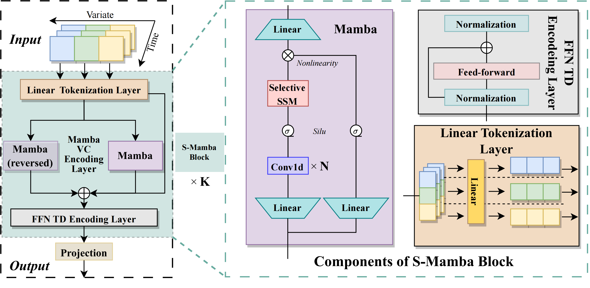

# Is Mamba Effective for Time Series Forecasting?

<a href='https://arxiv.org/abs/2403.11144'></a>

## :loudspeaker: Latest Updates

- **2023 Apr-02** : Updated our paper and released the code. You can refer to [[arXiv]](https://arxiv.org/abs/2403.11144) (new version coming soon) for more details.

## S-Mamba



## Contributions :trophy:

- We propose S-Mamba, a Mamba-based model for TSF, which delegates the extraction of inter-variate correlations and temporal dependencies to a bidirectional Mamba block and a Feed-Forward network. 
- We evaluate the performance of S-Mamba, which not only has low GPU memory required and short time for forecasts but also maintains superior performance compared to the representative and state-of-the-art models. 
- We conduct extensive experiments to further delve deeper into Mamba's potential in TSF tasks.

## Getting Start :hourglass_flowing_sand:

1. Install.

```bash
pip install -r requirements.txt
```

2. Train and evaluate.

```bash
bash ./scripts\multivariate_forecasting\ECL\S_Mamba.sh
```


## Acknowledgement :pray:

We are grateful for the following awesome projects when implementing S-Mamba:

- [iTransformer](https://github.com/thuml/iTransformer)
- [Mamba](https://github.com/state-spaces/mamba)

## Citation  
If you find our work  useful in your research, please consider citing DreamLLM:
```
@article{wang2024mamba,
  title={Is Mamba Effective for Time Series Forecasting?},
  author={Wang, Zihan and Kong, Fanheng and Feng, Shi and Wang, Ming and Zhao, Han and Wang, Daling and Zhang, Yifei},
  journal={arXiv preprint arXiv:2403.11144},
  year={2024}
}
```